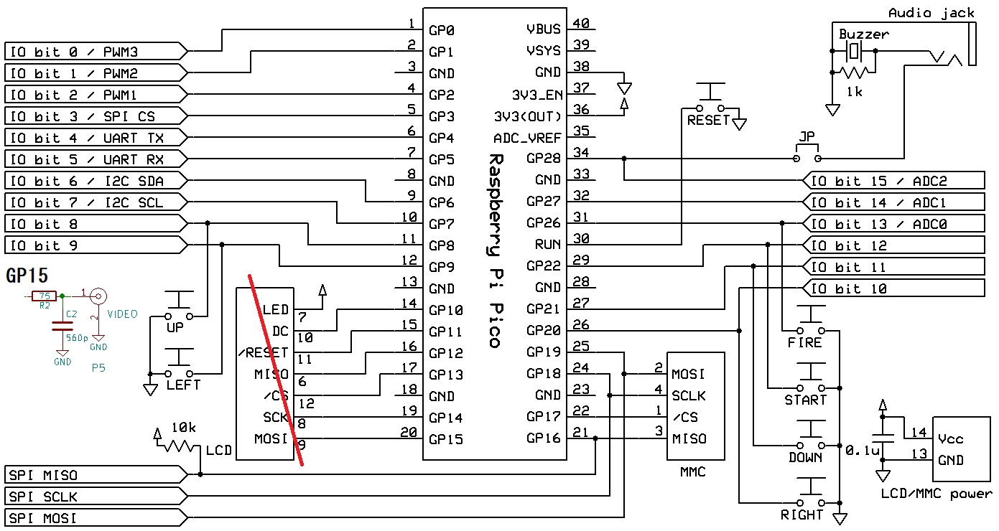

# MachiKania type PU
## 始めに
MachiKania type PUは現在開発中のRP2040マイコン向けビデオ出力対応BASIC利用システムです。開発途中のため、今後仕様は変更となる可能性があります。  
MachiKania type PUは大きく2種類の構成があります。1つはMachiKania type Pから液晶ディスプレイを取り外し、代わりにビデオ出力機能を追加したもの（Case 1）、もう一つはXIAO RP2040など小型のRP2040搭載マイコン基板向けに新たに設計し直したもの（Case 2）で、接続構成が大きく異なります。そのため、それぞれに異なる実行用バイナリファイルを用意しています。また、Case 1では、無線LAN環境に対応したRaspberry Pi Pico Pico W用バイナリも用意しました。  
実行用バイナリファイルはuf2ディレクトリ配下のそれぞれの名称のディレクトリのものをご利用ください。さらに、それぞれがUSBキーボード利用版とPC接続利用版がありますので、利用環境に合わせてRP2040マイコンにインストールしてください。  
Case 2用の頒布中実験基板については、以下のチラシをご参照ください。  
<a href="./documents/MachiKania-RP2040-Video.pdf">MachiKania-RP2040-Video.pdf</a>

## MachiKania RP2040 Video
MachiKania RP2040 Video is a BASIC compiler for ARMv6-M, especially for Raspberry Pi Pico, Pico W, XIAO RP2040, Tiny 2040 and RP2040-Zero.  
MachiKania RP2040 Video is currently an experimental project. Hardware specifications may change in the future.  
This project is being developed by modifying MachiKania type P (code name Phyllosoma), so many documents and scripts still contain references to Phyllosoma.

## how to compile
cmake and make. The pico-sdk (ver 1.5.0 is confirmed for building) with tinyusb (ver 0.15.0 is confirmed for building), cyw43-driver, lwip, and mbedtls submodules is required. In config.cmake, select configuration option to build by enabling "set()" command. Currently, there are following options:  
  
1. set(MACHIKANIA_BUILD pico_ntsc) : for Raspberry Pi Pico
2. set(MACHIKANIA_BUILD xiao_ntsc) : for XIAO RP2040, Tiny 2040 and RP2040-Zero
3. #set(MACHIKANIA_BUILD pico_w_ntsc) : for Raspberry Pi Pico W

## how to use
Copy "puerulus.uf2" to the RPI-RP2 drive of Raspberry Pi Pico or Pico W. Immediately connect to COMx port (com number depends on environment) by serial console at 115200 baud rate, if needed. Alternatively, copy "puerulus_kb.uf2" to the RPI-RP2 drive for using USB keyboard directly connected to Raspberry Pi Pico (or Pico W).
  
## .uf2 files
Excecutable binary files (.uf2) are available in "uf2" directory. The "xiao" directory contains files for XIAO, Tiny and Zero.  

## License
Most of codes (written in C) are provided with LGPL 2.1 license, but some codes are provided with the other licenses. See the comment of each file.

## Connection
### Case 1. MachiKania type P + Video adapter - LCD
Connect a Raspberry Pi Pico to a TV (NTSC Video) and an MultiMediaCard (SPI connection) as follows.
  
Note that USB keyboard is connected to micro-USB B port of Raspberry Pi Pico (or Pico W) board when required.

```console
GP0 I/O bit0 / PWM3
GP1 I/O bit1 / PWM2
GP2 I/O bit2 / PWM1
GP3 I/O bit3 / SPI CS
GP4 I/O bit4 / UART TX
GP5 I/O bit5 / UART RX
GP6 I/O bit6 / I2C SDA
GP7 I/O bit7 / I2C SCL
GP8 I/O bit8 / button1 (UP)
GP9 I/O bit9 / button2 (LEFT)
GP10 
GP11 
GP12 
GP13 
GP14 
GP15 Video Out
GP16 SD-DO(MISO) / SPI RX (pulled up by a 10k ohm resistor)
GP17 SD-CS
GP18 SD-SCLK / SCK
GP19 SD-DI(MOSI) / SPI TX
GP20 I/O bit10 / button3 (RIGHT)
GP21 I/O bit11 / button4 (DOWN)
GP22 I/O bit12 / button5 (START)
GP26 I/O bit13 / button6 (FIRE) / ADC0
GP27 I/O bit14 / ADC1
GP28 I/O bit15 / SOUND OUT / ADC2
GP29 ADC3
```
  
### Case 2. For XIAO RP2040, Tiny2040, RP2040-Zero
Connect XIAO RP2040 or Tiny2040 or RP2040-Zero to a TV (NTSC Video) and an MultiMediaCard (SPI connection) as follows.

  
```console
	GP0 UART TX / PWM1
	GP1 button5 (START) / PWM2
	GP2 SD-SCLK / SCK
	GP3 SD-DI(MOSI) / SPI TX
	GP4 SD-DO(MISO) / SPI RX (pulled up by a 10k ohm resistor)
	GP5 button6 (FIRE)
	GP6 SD-CS
	GP7 NTSC Video out
	GP8 PWM3
	GP9
	GP10
	GP11
	GP12 button1 (UP)
	GP13 button2 (LEFT)
	GP14 button3 (RIGHT)
	GP15 button4 (DOWN)
	GP16
	GP17
	GP18
	GP19
	GP20
	GP21
	GP22
	GP23
	GP24
	GP25
	GP26 ADC0 / I2C SDA
	GP27 ADC1 / I2C SCL
	GP28 SOUND OUT / ADC2
	GP29 ADC3 / SPI CS (default)
```
For more details, please see documents/MachiKania-RP2040-Video.pdf.

## Using Keyboard
The puerulus_kb.uf2 firmware supports using USB keyboard. Connect the USB keyboard to micro B socket of Raspberry Pi pico (or Pico W) through an USB-OTG cable, and supply 5V power to VBUS pin (#40).  
Alternatevely, as before, the puerulus.uf2 firmware supports the USB serial connection between MachiKania and PC.
